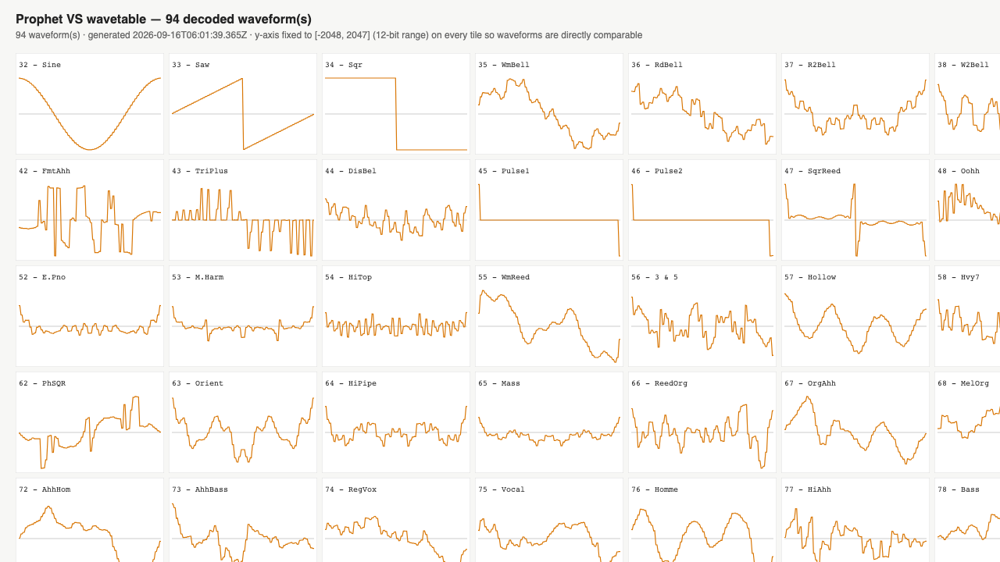

# Prophet VS wavetable ROM converter

Decodes the Sequential Prophet VS factory wavetables from ROM images
or VS-WAVES.DAT into raw data, WAV files, and C++ arrays.

This repository includes both a command-line converter and a web-based UI.
The UI is a single HTML file that can be opened directly in any browser.

As with all projects like this, you need to supply your own ROM images.
You need to have the right to own and use those to legally use this converter. 
The ROMs are not included in this repository.




## Why does this script exist?

The waves are originally stored in the two Prophet VS ROMs (MSB/high/upper and LSB/low).

There are several versions of extracted VS waveforms out there. In particular, I found
one version with each wave in an .AIF format, 336 samples per wave. There are also
several others adapted for various synths. Some are upsampled; many are
payware.

The .AIF version is especially odd. The Prophet VS has 94 factory waveforms,
plus 2 special ones (silence and white noise, which is generated on the fly).
The .AIF set has 104 entries, and there are gaps in the numbering. After comparing
the waves with known visualizations of each waveform, it is clear that they are
either reversed/inverted or do not start and stop at the correct phase. That may
not be a problem for use, but I wanted to see and prove what the original waves look
like.

## The ROM format

- The two ROM chip dumps are interleaved byte-for-byte into one memory
  image: `mem[0]=MSB[0], mem[1]=LSB[0], mem[2]=MSB[1], ...`
- The factory wavetable starts at byte address 47296 in the interleaved image. The first waveform is 
  VS wave 32
- From there, each waveform occupies a fixed 192-byte "slot":
  - The first **128 bytes** are plain **signed 8-bit** samples, one byte per
    waveform sample — the coarse part of each 12-bit sample.
  - The remaining **64 bytes** pack two 4-bit "fine" nibbles per byte, high
    nibble first: `tailByte[i]` holds the fine nibble for sample `2*i` in
    its upper 4 bits and for sample `2*i+1` in its lower 4 bits.
  - They recombine as `sample12 = int8(headByte) * 16 + fineNibble`
    (range -2048..2047). Upconverting to 16 bit simply left shifts by four
    keeping the lowest bits at 0

## Setup

To build the converter, install Node.js and run:

```sh
npm install
npm run build
```

PS: The build step is optional, you can run the CLI or UI versions directly,
see below. The build step is only needed if you want to modify the source code.

## Usage, UI version

Open `ui/decoder-ui.html` in any browser. It does not require any setup unless
you have changed the source code. Because the UI is a single file, it does not
hot-reload when the source changes.

## Usage, command line version

Run directly with `ts-node` (no build step needed):

```sh
npx ts-node src/convert.ts \
  --msb /path/to/PVSMSB.BIN \
  --lsb /path/to/PVSLSB.BIN \
  --out ./output \
  --all
```

Or decode a prebuilt VS-WAVES.DAT dump instead of the physical ROM images:

```sh
npx ts-node src/convert.ts \
  --vswave /path/to/VS-WAVES.DAT \
  --out ./output \
  --all
```

Or compile to plain JS first. Compiling also rebuilds the ui:

```sh
npm run build
node dist/convert.js --msb PVSMSB.BIN --lsb PVSLSB.BIN --out ./output --all
```

### Output selection

Pass any combination of these flags (default: all of them, if none are given):

| flag | output |
|---|---|
| `--wav-combined` | One WAV file with every selected waveform back to back, such as `prophet_vs_waves_all_16bit.wav` |
| `--wav-separate` | One WAV file per waveform under `wav/wave_NNN.wav` |
| `--header` | One C++ header using the selected bit depth (for example `prophet_vs_waves_16bit.h`) |
| `--raw` | One raw binary file per waveform under `data16/wave_NNN.i16` or `data12/wave_NNN.i12` |
| `--chart` | One HTML file (`prophet_vs_waves_chart.html`) with a small-multiples SVG chart of every decoded waveform — open it in any browser. The chart should match the one at the start of this file |

### Chart options

```
--chart-columns <n>   Waveform tiles per row in the chart grid (default: 10)
```

The chart plots every decoded waveform on the same fixed y-axis (the full
16-bit or 12-bit range, depending on `--bit-depth`), so waveform shapes and
amplitudes are directly comparable at a glance.

### Other options

```
--out <dir>           Output directory (default: ./output)
--start <n>           First waveform index to decode (default: 32)
--count <n>           Number of waveform indices to attempt (default: 94, i.e. up to
                       index 125 — see "Default range" below)
--msb <path>          Path to the MSB ROM image (required with `--lsb`)
--lsb <path>          Path to the LSB ROM image (required with `--msb`)
--vswave <path>       Decode directly from a VS-WAVES.DAT dump instead of MSB/LSB ROM images
--bit-depth <n>       16 (default) or 12; applies to WAV, raw, header, and chart output
--sample-rate <n>     Sample rate written into WAV headers (default: 32000 — arbitrary;
                       the real VS oscillator rate depends on the note and pitch played)
--verbose             Print per-wave progress
--help                Show usage
```

The ROM-backed factory waveform set is fixed to waveform indices 32..125. Requests
that try to start before 32 or extend past 125 are rejected.

## Default range

By default, the converter decodes the 94 factory waveforms with indices
**32-125** (`--start 32 --count 94`). These are the only waveforms in the ROM files:

- **0-31** — user-programmable RAM slots, not part of the factory ROM set.
- **126** — silent placeholder wave.
- **127** — generated noise waveform, not a stored ROM waveform.
